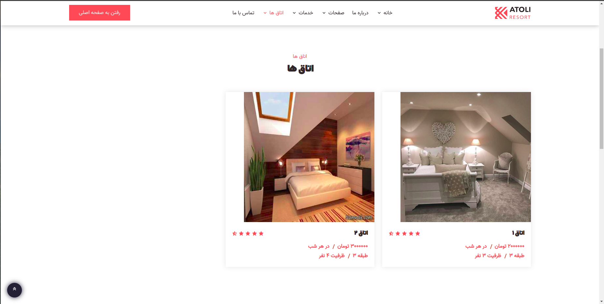
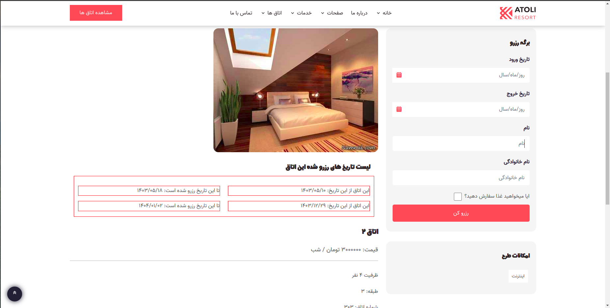
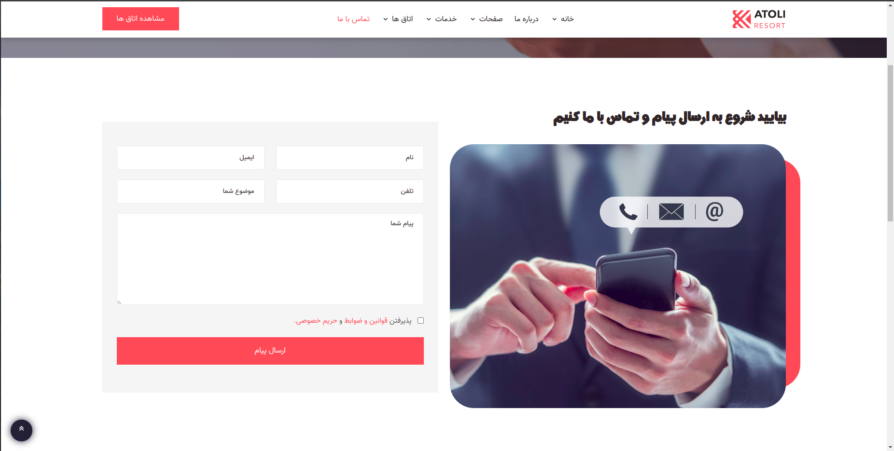
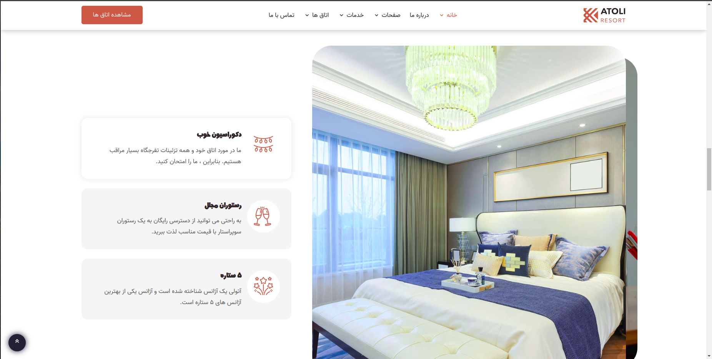

# hotel_reserve
Hotel reservation system 
## How to run

1. Install python3, pip, virtualenv in your system.
2. Clone the project https://github.com/MohammadAminJorian/hotel_reserve.
3. Make development environment ready and run project using commands below;
git clone https://github.com/MohammadAminJorian/hotel_reserve && cd hotel_reserve
python venv  env  # Create virtualenv named env
source env/bin/activate
pip install -r requirements.txt
mv  hotel_reserve/settings.py hotel_reserve/settings.py
python manage.py migrate  # Create database tables  
python manage.py runserver

1 .Has a room reservation system 
2 .Has a room reservation food system 
3 .Has a verify_phone 
4 .Has customize admin panel 
5 .Has persian admin panel 
6 .Has custom calculate reserve day 
7 .Has custom calculate food number 
8 .Has custom reserve error day 
9 .Has jalaly date 
and ...

 
 

# رزرو هتل

دارای سیستم رزرویشن هتل

## اجرای کد

1. را در سیستم خود نصب کنید python3, pip, virtualenv 
2. پروژه را کلون کنید https://github.com/MohammadAminJorian/hotel_reserve.
3. محیط توسعه و پروژه را با استفاده از دستورات زیر آماده کنید. 
git clone https://github.com/MohammadAminJorian/hotel_reserve && cd hotel_reserve
python -m venv env # ایجاد کنید env را با نام  virtualenv 
اجرای محیط توسعه env/bin/activate 
pip install -r requires.txt 
hotel_reserve/settings.py hotel_reserve/settings.py  
python manager.py migrate # جداول پایگاه داده ایجاد کنید 
python manager.py runserver  

1 .دارای سیستم رزرو اتاق 
2 .دارای سیستم غذای  اتاق رزرو شده 
3 .دارای تایید شماره 
4 . دارای پنل مدیریت سفارشی 
5 .دارای پنل مدیریت فارسی 
6 .دارای محاسبه ویژه روز رزرو 
7 .دارای محاسبه ویژه شمارش غذا 
8 . دارای خطای رزرو روز سفارشی 
9 . دارای تاریخ جلالی 
و...

 

 

 

 

