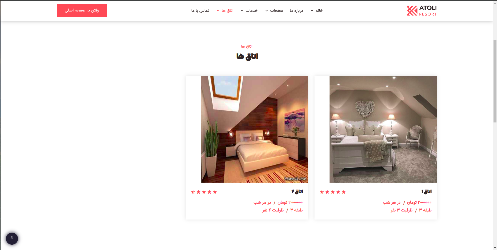
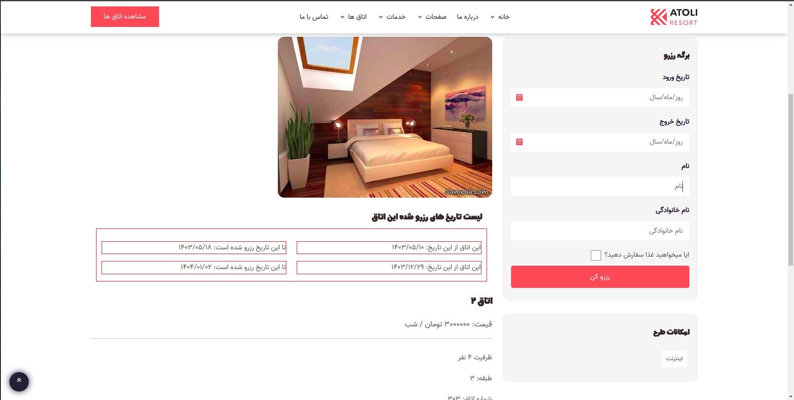
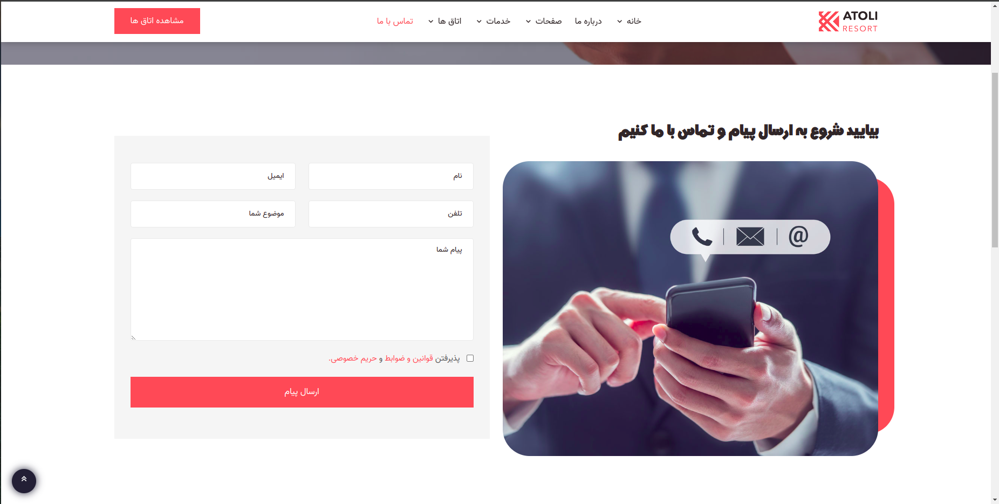
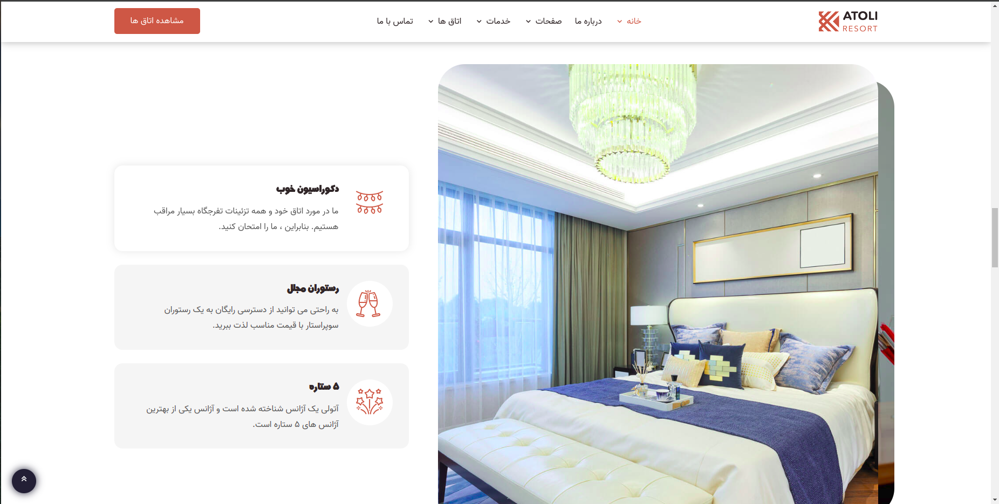

# 🏨 Hotel Reservation System

<p align="center">
  <strong>A modern Django-based hotel reservation platform</strong>
</p>

<p align="center">
  Room Reservation • Food Management • Phone Verification • Jalali Calendar • Custom Admin
</p>

<p align="center">
  <a href="https://github.com/MohammadAminJorian/hotel_reserve">
    
  </a>
  
  
</p>

---

## 🌟 About The Project

**Hotel Reservation System** is a web application built with **Python and Django** for managing hotel room reservations and related services.

The project focuses on implementing real-world reservation logic, including reservation date calculations, food quantity management, reservation conflict validation, phone verification, and a customized Persian administration panel.

---

## ✨ Features

<table>
<tr>
<td width="50%">

### 🛏️ Reservation

* Room reservation
* Reservation date management
* Automatic reservation day calculation
* Reservation conflict detection
* Custom reservation validation

</td>

<td width="50%">

### 🍽️ Food Management

* Food management for reservations
* Automatic food quantity calculation
* Connecting food orders to reservations

</td>
</tr>

<tr>
<td width="50%">

### 👤 User Management

* Phone number verification
* User management
* Reservation management

</td>

<td width="50%">

### 🇮🇷 Persian Support

* Persian admin panel
* Jalali calendar
* Persian-friendly date handling
* RTL-oriented interface

</td>
</tr>
</table>

---

## 🛠️ Tech Stack

<p align="center">


</p>

---

# 📸 Screenshots

<p align="center">
  
</p>

<p align="center">
  
</p>

<p align="center">
  
</p>

<p align="center">
  
</p>

---

# 🚀 Getting Started

Follow the steps below to run the project locally.

### 1️⃣ Clone the repository

```bash
git clone https://github.com/MohammadAminJorian/hotel_reserve.git
cd hotel_reserve
```

### 2️⃣ Create a virtual environment

```bash
python -m venv env
```

### 3️⃣ Activate the environment

**Windows**

```bash
env\Scripts\activate
```

**Linux / macOS**

```bash
source env/bin/activate
```

### 4️⃣ Install dependencies

```bash
pip install -r requirements.txt
```

### 5️⃣ Apply migrations

```bash
python manage.py migrate
```

### 6️⃣ Create an admin user

```bash
python manage.py createsuperuser
```

### 7️⃣ Run the server

```bash
python manage.py runserver
```

Open your browser and visit:

```text
http://127.0.0.1:8000/
```

---

# ⚙️ Project Structure

```text
hotel_reserve/
│
├── hotel_reserve/
│   ├── settings.py
│   ├── urls.py
│   └── ...
│
├── ...
│
├── manage.py
├── requirements.txt
├── README.md
│
├── img.png
├── img_2.png
├── img_3.png
└── img_4.png
```

---

# 🧠 What I Implemented

This project includes custom business logic rather than being only a basic Django CRUD application.

### 📅 Reservation Logic

The system handles:

* Reservation duration
* Reservation date calculations
* Available dates
* Invalid reservation dates
* Reservation conflicts

### 🍽️ Food Calculation

Food quantities are calculated based on reservation information and the number of reservation days.

### 📱 Phone Verification

A phone verification flow is included to validate users during the application workflow.

### 🇮🇷 Persian Administration

The administration experience has been customized for Persian-speaking users, including Jalali date support.

---

# 🔮 Future Improvements

Possible future improvements include:

* 💳 Online payment integration
* 📧 Email notifications
* 📱 SMS notifications
* 🏨 Advanced room availability
* 📊 Reservation analytics dashboard
* 👥 Role-based access control
* 🐳 Docker deployment
* ☁️ Production deployment

---

# 👨‍💻 Developer

<p align="center">

<strong>Mohammad Amin Jorian</strong>

<br><br>

<a href="https://github.com/MohammadAminJorian">
  
</a>

<a href="https://mohammadaminjorian.github.io/Portfolio/">
  
</a>

</p>

---

## ⭐ Support

If you found this project interesting, consider giving it a ⭐ on GitHub.

---

<p align="center">
  Made with ❤️ using Python & Django
</p>

<br>
<br>

# 🇮🇷 سامانه رزرو هتل

<p align="center">
  <strong>یک پلتفرم مدرن مبتنی بر Django برای مدیریت رزرو هتل</strong>
</p>

<p align="center">
  رزرو اتاق • مدیریت غذا • تأیید شماره تلفن • تقویم جلالی • پنل مدیریت سفارشی
</p>

<p align="center">
  <a href="https://github.com/MohammadAminJorian/hotel_reserve">
    
  </a>
  
  
</p>

---

## 🌟 درباره پروژه

**سامانه رزرو هتل** یک وب‌اپلیکیشن ساخته‌شده با **Python و Django** برای مدیریت رزرو اتاق‌های هتل و خدمات مرتبط با آن است.

تمرکز اصلی این پروژه روی پیاده‌سازی منطق واقعی رزرو هتل است؛ از جمله محاسبه مدت زمان رزرو، محاسبه تعداد غذا، بررسی تداخل رزروها، تأیید شماره تلفن و ایجاد یک پنل مدیریت فارسی و سفارشی.

---

## ✨ امکانات پروژه

<table>
<tr>
<td width="50%">

### 🛏️ سیستم رزرو

* رزرو اتاق
* مدیریت تاریخ رزرو
* محاسبه خودکار تعداد روزهای رزرو
* تشخیص تداخل رزروها
* اعتبارسنجی اختصاصی رزرو

</td>

<td width="50%">

### 🍽️ مدیریت غذا

* مدیریت غذای رزروها
* محاسبه خودکار تعداد غذا
* اتصال سفارش غذا به رزرو

</td>
</tr>

<tr>
<td width="50%">

### 👤 مدیریت کاربران

* تأیید شماره تلفن
* مدیریت کاربران
* مدیریت رزروها

</td>

<td width="50%">

### 🇮🇷 پشتیبانی فارسی

* پنل مدیریت فارسی
* تقویم جلالی
* مدیریت تاریخ به زبان فارسی
* رابط کاربری راست‌چین

</td>
</tr>
</table>

---

## 🛠️ تکنولوژی‌های استفاده‌شده

<p align="center">


</p>

---

# 📸 تصاویر پروژه

<p align="center">
  
</p>

<p align="center">
  
</p>

<p align="center">
  
</p>

<p align="center">
  
</p>

---

# 🚀 نصب و اجرای پروژه

برای اجرای پروژه به صورت محلی، مراحل زیر را انجام دهید.

### 1️⃣ کلون کردن پروژه

```bash
git clone https://github.com/MohammadAminJorian/hotel_reserve.git
cd hotel_reserve
```

### 2️⃣ ساخت محیط مجازی

```bash
python -m venv env
```

### 3️⃣ فعال‌سازی محیط مجازی

**Windows**

```bash
env\Scripts\activate
```

**Linux / macOS**

```bash
source env/bin/activate
```

### 4️⃣ نصب وابستگی‌ها

```bash
pip install -r requirements.txt
```

### 5️⃣ اجرای Migration

```bash
python manage.py migrate
```

### 6️⃣ ساخت کاربر مدیر

```bash
python manage.py createsuperuser
```

### 7️⃣ اجرای سرور

```bash
python manage.py runserver
```

سپس مرورگر خود را باز کرده و به آدرس زیر بروید:

```text
http://127.0.0.1:8000/
```

---

# ⚙️ ساختار پروژه

```text
hotel_reserve/
│
├── hotel_reserve/
│   ├── settings.py
│   ├── urls.py
│   └── ...
│
├── ...
│
├── manage.py
├── requirements.txt
├── README.md
│
├── img.png
├── img_2.png
├── img_3.png
└── img_4.png
```

---

# 🧠 بخش‌هایی که پیاده‌سازی شده‌اند

این پروژه فقط یک CRUD ساده Django نیست و شامل منطق اختصاصی برای مدیریت رزرو است.

### 📅 منطق رزرو

سیستم موارد زیر را مدیریت می‌کند:

* مدت زمان رزرو
* محاسبه تاریخ‌های رزرو
* تاریخ‌های قابل رزرو
* تاریخ‌های نامعتبر
* تداخل رزروها

### 🍽️ محاسبه غذا

تعداد غذا بر اساس اطلاعات رزرو و تعداد روزهای اقامت محاسبه می‌شود.

### 📱 تأیید شماره تلفن

یک فرآیند تأیید شماره تلفن برای اعتبارسنجی کاربران در سیستم پیاده‌سازی شده است.

### 🇮🇷 پنل مدیریت فارسی

پنل مدیریت پروژه برای کاربران فارسی‌زبان سفارشی‌سازی شده و از تاریخ جلالی نیز پشتیبانی می‌کند.

---

# 🔮 امکانات قابل توسعه

برخی از قابلیت‌هایی که می‌توان در آینده به پروژه اضافه کرد:

* 💳 اتصال به درگاه پرداخت آنلاین
* 📧 ارسال اعلان و ایمیل
* 📱 ارسال پیامک
* 🏨 سیستم پیشرفته مدیریت ظرفیت اتاق‌ها
* 📊 داشبورد آمار و تحلیل رزروها
* 👥 سیستم مدیریت نقش‌ها و سطح دسترسی
* 🐳 Docker
* ☁️ استقرار در محیط Production

---

# 👨‍💻 توسعه‌دهنده

<p align="center">

<strong>Mohammad Amin Jorian</strong>

<br><br>

<a href="https://github.com/MohammadAminJorian">
  
</a>

<a href="https://mohammadaminjorian.github.io/Portfolio/">
  
</a>

</p>

---

## ⭐ حمایت از پروژه

اگر این پروژه برای شما جالب بود، می‌توانید با دادن یک ⭐ به Repository از پروژه حمایت کنید.

---

<p align="center">
  ساخته‌شده با ❤️ و استفاده از Python و Django
</p>
